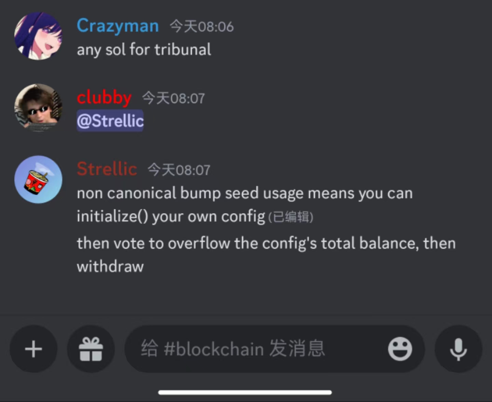

# tribunal (10 solves)

> TL;DR _Solana ebpf_

I solve this challenge far after the game ended.

> [A good read by sec3](https://medium.com/coinmonks/security-of-solana-smart-contracts-why-you-should-always-validate-pda-bump-seeds-d068095fc772)

This is a example challenge of using `non canonical bump seed` to fake pdaS! Learned it.

see [exploit.py](./exploit.py)